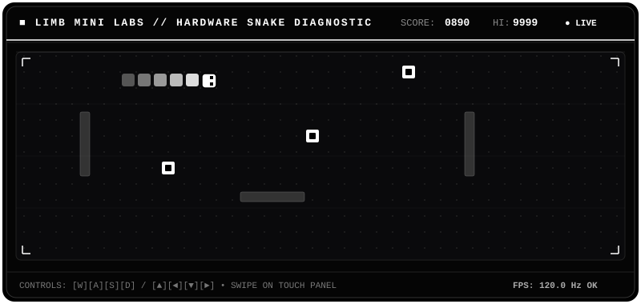
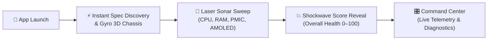

<div align="center">

# 🦿 Limb — Next-Gen Hardware Diagnostics

### *Calm. Minimalist. Ultra-Fast. Zero-Signup Android Phone Health Lab.*

[](https://kotlinlang.org/)
[](https://developer.android.com/jetpack/compose)
[](https://android.com)
[]()
[]()

<br/>

<p align="center">
  <a href="#-key-features"><b>Explore Features</b></a> •
  <a href="#-limb-arcade--monochrome-snake-mini"><b>Arcade Snake</b></a> •
  <a href="#-the-hyperspace-flow"><b>Hyperspace Flow</b></a> •
  <a href="#-diagnostic-matrix"><b>Diagnostic Suite</b></a> •
  <a href="#-tech-stack"><b>Tech Stack</b></a> •
  <a href="#-getting-started"><b>Get Started</b></a>
</p>

```
  ✦  ZERO SIGN-UP  ✦  ZERO ADS  ✦  ZERO TRACKING  ✦  100% ON-DEVICE  ✦
```

---

</div>

<br/>

## 🕹️ Limb Arcade — Monochrome Snake Mini

> *A pure black & white, retro cybernetic digitizer & latency verification visualizer.*

<div align="center">



<br/>

```
┌────────────────────────────────────────────────────────────────────────┐
│  ▲ [W] : UP    │  ◄ [A] : LEFT  │  ▼ [S] : DOWN  │  ► [D] : RIGHT      │
│  SCORE: 0890   │  LENGTH: 6 px  │  REFRESH: 120Hz│  TELEMETRY: NOMINAL │
└────────────────────────────────────────────────────────────────────────┘
```

</div>

---

<br/>

## 🌌 Why Limb?

Most phone diagnostic tools look like clunky 2011 developer menus — stuffed with confusing test numbers, intrusive ads, mandatory account registrations, and slow loading screens.

**Limb reimagines device verification from first principles.** It pairs high-precision Android HAL sensor telemetry with a sleek, cybernetic aesthetic inspired by aerospace avionics and high-end automotive instrument clusters.

<br/>

```
┌────────────────────────────────────────────────────────────────────────┐
│  ⚡ INSTANT ACTIVATION  │  🎛️ FROSTED FLOATING DOCK  │  📊 LIVE TELEMETRY  │
│  8s Sonar Sweep Scan   │  Fluid Micro-Interactions  │  CPU & Thermal HUD │
└────────────────────────────────────────────────────────────────────────┘
```

---

<br/>

## ✨ Key Features

<table width="100%">
<tr>
<td width="50%" valign="top">

### ⚡ Zero-Signup "Hyperspace" Activation
* **Instant Device Discovery**: Detects SoC architecture, display matrix, and registered sensors in < 100ms.
* **Gyro-Reactive 3D Chassis**: Interactive wireframe reflecting device tilt in real time.
* **Laser Sonar Radar Sweep**: Cinematic 5-stage diagnostic sweep across all core subsystems.
* **Shockwave Score Reveal**: Smooth animated health score calculation (0–100) on first launch.

</td>
<td width="50%" valign="top">

### 🎛️ Floating Frosted Capsule Dock
* **Floating Geometry**: `32dp` rounded corner capsule dock floating gracefully over content.
* **Haptic Micro-Interactions**: Subtle, tactile feedback tuned for high-refresh 120Hz displays.
* **Adaptive Dark & Light Themes**: Deep OLED charcoal (`#09090B`) with high-contrast emerald & amber accents.

</td>
</tr>
<tr>
<td width="50%" valign="top">

### 📊 Live Telemetry HUD Cluster
* **Real-time CPU Monitoring**: Active vs. idle core bars for multi-core processors.
* **Thermal Zone Governor**: Live package thermal monitoring (°C) and throttling alert.
* **JVM Heap & RAM Headroom**: Real-time memory pressure and allocation visualizer.

</td>
<td width="50%" valign="top">

### 📑 Plain-Language Diagnostic Reports
* **Honest Hardware Reporting**: Zero fake values. Absent hardware is marked honestly as *Not Available*.
* **Compact High-Density Cards**: Key-value pairs (DPI, Hz, mV, dB) chunked in neat inline 2-column cards.
* **One-Tap Share Sheet**: Generates formatted plaintext summaries for secondhand sales and repair shops.

</td>
</tr>
</table>

---

<br/>

## 🛸 The Hyperspace Flow



---

<br/>

## 🧪 Comprehensive Diagnostic Matrix

Limb tests **30+ hardware and software points** grouped into 8 modular diagnostic engines:

<details open>
<summary><b>📱 1. Display & Digitizer</b></summary>
<br/>

| Test Name | Mode | Verification Parameters |
|:---|:---:|:---|
| **Dead Pixel Inspector** | Interactive | Full-screen RGBW pure color fields for subpixel fault detection |
| **Touch Matrix Digitizer** | Interactive | Multi-tile coordinate grid tracking digitizer responsiveness |
| **Multi-touch Constellation** | Interactive | Simultaneous pointer coordinates, distance tracking, electric arcs |
| **Luminance & Brightness** | Interactive | Smooth hardware brightness curve modulation across 0–100% |
| **Refresh Rate (Hz)** | Automated | Display controller frame pacing (60Hz / 90Hz / 120Hz / 144Hz) |
| **Resolution & Density** | Automated | Native matrix resolution (`px`), DPI density, and HDR capability |

</details>

<details open>
<summary><b>🧭 2. Motion, Environmental & Magnetic Sensors</b></summary>
<br/>

| Sensor Component | Mode | Verification Parameters |
|:---|:---:|:---|
| **3D Accelerometer** | Interactive | Real-time X/Y/Z gravitational acceleration bubble visualizer |
| **Gyroscope** | Interactive | Angular velocity ($rad/s$) and rotational vector pitch/roll |
| **Proximity Sensor** | Interactive | Real-time infra-red optical occlusion near receiver |
| **Ambient Light Sensor** | Interactive | Environmental lux illuminance meter |
| **Magnetometer / Compass**| Interactive | Microtesla ($\mu T$) flux density and azimuth heading |
| **Barometric Altimeter** | Automated | Atmospheric pressure ($hPa$) and barometric altitude |

</details>

<details>
<summary><b>📷 3. Optical Cameras (CameraX HAL)</b></summary>
<br/>

* **Rear Ultra-HD Lens**: Live CameraX viewfinder feed, auto-exposure, and continuous focus.
* **Front Selfie Camera**: Front-facing sensor resolution, aspect ratio, and lens alignment.
* **LED Torch / Flash IC**: Hardware strobe activation and thermal pulse check.
* **Multi-Camera Enumeration**: Camera2 API enumeration of physical and logical lens setups.

</details>

<details>
<summary><b>🔊 4. Acoustic & Haptic Subsystems</b></summary>
<br/>

* **Primary Loudspeaker**: 440 Hz standard acoustic sine wave tone generator.
* **Earpiece Receiver**: High-frequency voice call receiver routing test.
* **Microphone Visualizer**: Live audio amplitude dB meter and dynamic waveform canvas.
* **Haptic Actuators**: Vibrator engine patterns (*Tick, Click, Heavy Click, Pulse Wave*).

</details>

<details>
<summary><b>🔋 5. Power IC & Battery Health</b></summary>
<br/>

* **Battery Condition**: PMIC reported cell state, health grade, and cycle condition.
* **Live Voltage & Thermal**: Millivolt ($mV$) terminal potential and internal temperature ($^\circ C$).
* **Power Source Detection**: AC, USB-PD, Wireless Qi charging recognition.

</details>

<details>
<summary><b>📡 6. Network & Radios</b></summary>
<br/>

* **Wi-Fi 6/6E/7**: SSID link state, RSSI signal strength, and link speed ($Mbps$).
* **Bluetooth Core / BLE**: Bluetooth adapter state and BLE peripheral capability.
* **Cellular Modem**: Carrier identity, SIM state, network generation (4G / 5G).
* **GNSS / GPS Receiver**: Satellite positioning provider availability.
* **NFC Transceiver**: Near-field communication reader/writer readiness.

</details>

---

<br/>

## 🛠️ Architecture & Tech Stack

```
com.limb.diagnostics
 ├── 📦 data          # DiagnosticRepository, persistent state & share sheet generator
 ├── 📦 engine        # 8 Isolated HAL diagnostic engines (Display, Sensor, Audio, etc.)
 ├── 📦 model         # Immutable Diagnostic models, health score algorithms & enums
 ├── 📦 ui
 │    ├── 📱 navigation  # LimbApp NavHost, capsule bottom bar, transitions
 │    ├── 📱 screens     # HomeScreen, OnboardingScanScreen, ReportsScreen, TestsLibraryScreen
 │    │    └── 🎨 interactive # Dedicated touch, audio, camera, sensor test screens
 │    └── 🎨 theme       # LimbTheme, Color palette, Typography, Frosted HUD Components
```

* **UI Framework**: 100% Jetpack Compose with Material 3 & Compose Animation
* **Language**: Kotlin 2.0 (Coroutines, StateFlow, Channel)
* **Hardware APIs**: AndroidX CameraX, AudioTrack, SensorManager, BatteryManager
* **Build System**: Gradle 8.9 with Version Catalog (`libs.versions.toml`)

---

<br/>

## 🚀 Getting Started

### Prerequisites
* **Android Studio Ladybug (2024.2+)** or latest IntelliJ IDEA
* **JDK 17**
* **Android SDK**: `compileSdk = 35`, `minSdk = 26` (Android 8.0 Oreo+)

### Build & Run via Command Line

```bash
# Clone the repository
git clone https://github.com/neuroglowupz-hash/limb.git
cd limb

# Build the Debug APK
./gradlew assembleDebug

# Install directly to connected device / emulator
adb install -r app-debug.apk
```

---

<br/>

## 🛡️ Privacy by Design

> [!IMPORTANT]
> **Zero Analytics. Zero Telemetry. 100% On-Device.**
> Limb does not collect personal identifiers, device IMEI, serial numbers, or location data. All sensor samples, microphone waveforms, and camera viewfinders operate strictly in volatile memory and are destroyed when tests finish.

---

<br/>

<div align="center">

Made with 💚 for Android Enthusiasts, Technicians, and Conscious Users.

**[⬆ Back to top](#-limb--next-gen-hardware-diagnostics)**

</div>
